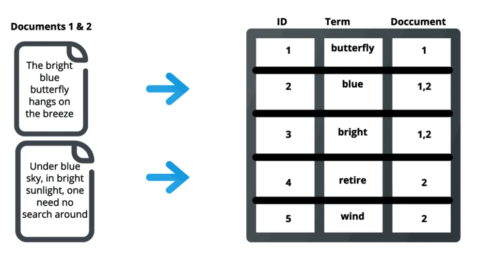
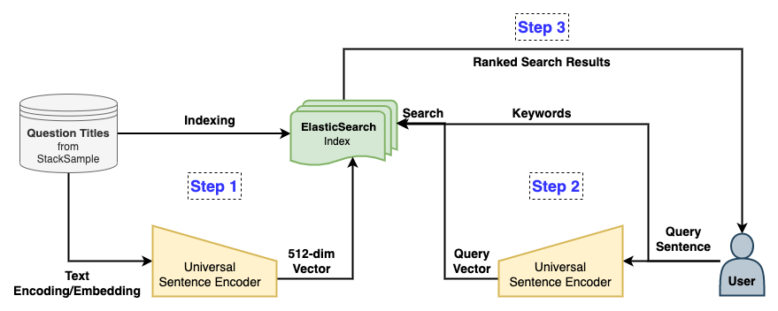

# Stackoverflow Q&A Search Engine
An application to store a collection of questions and answers data found on Stackoverflow in an index using [ElasticSearch](https://www.elastic.co/) and perform a text search on the stored Q&amp;A's based on semantic meaning.

## Overview

All of us have found the solution to some technical issue on [StackOverflow](https://stackoverflow.com/), at some point in our professional career or during a learning phase in the field of software solution development. It is the single largest platform for professionals and programming enthusiasts share their knowledge on their individual areas of expertise, help fellow programmers who by answering questions/queries posted on the public forum and also to look for help on any challenges faced in their domain. 

### Problem Statement

As we are already aware, StackOverflow has a collection of Questions (characterised by a series of **keywords**) posted by users along with the answers to those questions posted by other users. Here, the problem statement is to design a **Search Engine** for the StackOverflow platform where the user can simply enter a query and the related questions along with the answers submitted to them (if any). 

To be practically feasible, the search engine needs to possess the following characteristics :

* **Both Keyword AND Semantic search** - The search engine needs to be capable of returning results 
* **Low Latency** - Typically <500 milliseconds
* **High Precision and Recall**
* **Low Computational/Server costs** - For feasibility of deployment and scalability

## Dataset 

Here, we use the [**StackSample Dataset**](https://www.kaggle.com/stackoverflow/stacksample) which contains about **10%** of the total questions and answers found on the StackOverflow website in text format. 

The Dataset contains 3 .csv files the details of which are as follows : 

* **Questions.csv** - 1.92 GB

  | Id  | OwnerUserId | CreationDate | ClosedDate | Score | Title | Body |
  |:---:|:-----------:|:------------:|:----------:|:-----:|:-----:|:----:|
  | ... | ...         | ...          | ...        | ...   | ...   | ...  |
  
  
* **Answers.csv** - 1.61 GB

  | Id  | OwnerUserId | CreationDate | ParentId | Score | Body |
  |:---:|:-----------:|:------------:|:--------:|:-----:|:----:|
  | ... | ...         | ...          | ...      | ...   | ...  |
  
  
* **Tags.csv** - 65.48 MB

  | Id  | Tag |
  |:---:|:---:|
  | ... | ... |

## Design choices

In order to return the search results, there is a choice of entities in the dataset we choose to match with the query sentence, i.e. the text samples we consider in our [**StackSample Dataset**](https://www.kaggle.com/stackoverflow/stacksample) which would actually be matched/compared with the query string. Let us have a look at the possible options for this use case :

1. **Question *Titles* only**
2. **Question *Titles* + Question *Bodies* only**
3. **Question *Titles* + Question *Bodies* + Answer *Bodies***

Here, for simplicity and swift implementation, we match the query with the Question Titles in the dataset only. This can be easily upgraded to include the other options with some modifications. 

## Solution Approach

### Hashing + TF-IDF Scoring

This approach can be used for the **keyword-based search**. As we know, hashing refers to the technique of maintaining a collection of objects which can be indexed by a set of *keys*. Here, we break down the query sentence into individual words and create a hash table with each word being a key in it.  
Now, for the TF-IDF (Term Frequency - Inverse Document Frequency) score, we maintain the following Hashmaps :

* No. of occurences of each query word in the Questions where they are found in the dataset - **To Calculate Term Frequency**
* Set of the Questions where each query word is present - **To Calculate Inverse Document Frequency**. 

A combination of the above scores can be used to rank results returned in a keyword-based search.

### Semantic Similarity with Sentence Vectors

We know that any sentence of text can be represented in the form of a numerical vector which captures the semantic meaning of the passage/sentence. There are multiple methods of embedding sentences in vectors including the use of [Doc2Vec](https://radimrehurek.com/gensim/models/doc2vec.html), [SentenceBERT](https://medium.com/dair-ai/tl-dr-sentencebert-8dec326daf4e), [Universal Sentence Encoder](https://www.tensorflow.org/hub/tutorials/semantic_similarity_with_tf_hub_universal_encoder) etc.   

As we store the vector represenetations of the questions in our dataset, we can simply calculate the value of some similarity measure between the query sentence and the questions so that the results can be ranked on the basis of closest semantic meaning with the query. Some of the distance/similarity measures between the sentence vectors which can be used for the purpose are :

* [Euclidean Distance](https://en.wikipedia.org/wiki/Euclidean_distance#:~:text=In%20mathematics%2C%20the%20Euclidean%20distance,being%20called%20the%20Pythagorean%20distance.)
* [Cosine Similarity](https://en.wikipedia.org/wiki/Cosine_similarity#:~:text=In%20data%20analysis%2C%20Cosine%20similarity,to%20both%20have%20length%201.)
* Nearest Neighbor Search Methods
  * [NN Search](https://en.wikipedia.org/wiki/Nearest_neighbor_search#:~:text=Nearest%20neighbor%20search%20(NNS)%2C,the%20larger%20the%20function%20values.)
  * Approximate NN Search
  * [K-d Trees](https://en.wikipedia.org/wiki/K-d_tree)
  * [Locality-sensitive Hashing](https://en.wikipedia.org/wiki/Locality-sensitive_hashing) (LSH)
  * Neighborhood Graphs

Here, we have used the Universal Sentence Encoder (**USE**) offered by TensowFlow Hub to embed the Question titles in the dataset and the query text to **512-dimensional** vectors. In addition, we have used the built-in cosine similarity function in the native scripting language of ElasticSearch to rank results based on semantic meaning. 

## Adoption of ElasticSearch for our Use Case

[ElasticSearch](https://www.elastic.co/) is a distributed, open-source search and analytics engine built on Apache Lucene and developed in Java. It started as a scalable version of the Lucene open-source search framework then added the ability to horizontally scale Lucene indices. ElasticSearch allows you to store, search, and analyze huge volumes of data quickly and in near real-time and give back answers in milliseconds. It’s able to achieve fast search responses because instead of searching the text directly, it searches an index. It uses a structure based on documents instead of tables and schemas and comes with extensive REST APIs for storing and searching the data. At its core, you can think of ElasticSearch as a server that can process JSON requests and give you back JSON data. ([Source](https://www.knowi.com/blog/what-is-elastic-search/)). 

### Inverted Index in ElasticSearch

An index in Elasticsearch is actually what’s called an inverted index, which is the mechanism by which all search engines work. It is a data structure that stores a mapping from content, such as words or numbers, to its locations in a document or a set of documents. Basically, it is a hashmap-like data structure that directs you from a word to a document. An inverted index doesn’t store strings directly and instead splits each document up to individual search terms (i.e. each word) then maps each search term to the documents those search terms occur within. For example, in the image below, the term “best” occurs in document 2, so it is mapped to that document. This serves as a quick look-up of where to find search terms in a given document. By using distributed inverted indices, Elasticsearch quickly finds the best matches for full-text searches from even very large data sets. ([Source](https://www.knowi.com/blog/what-is-elastic-search/)).  

 

## Overall Design

Finally, we can put together an overall design approach for implementing the Keyword/Semantic Search Engine for StackOverflow Q&A. Let us frame the approach in the following steps :

* **Step 1 :** Pre-process the StackSample Dataset and store the Question titles, both in the text form and USE vector embeddings in an ElasticSearch Index
* **Step 2 :** Read the Query Sentence from the user, embed it in a 512-dimensional vector format using USE and feed them to the ElasticSearch instance using their Web-API. 
* **Step 3 :** Read the ranked results returned by ElasticSearch as per specified scoring/ranking functions in JSON format and post-process them to be displayed to the user.  

This overall approach can be easily visualized in the following diagram :  

 

There can also be a cloud implementation of this project on cloud platforms like Microsoft Azure, AWS and other PaaS providers as they offer built-in ElasticSearch capabilities using Web-APIs :
* [AWS ElasticSearch Service](https://aws.amazon.com/elasticsearch-service/)
* [ElasticSearch on Azure](https://azure.microsoft.com/en-in/overview/linux-on-azure/elastic/)

## References

* 

